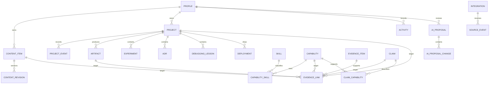

# usmanalii.com — Database and Evidence Model

**Document:** 2 of 6  
**Version:** 1.0  
**Depends on:** PRD v1.1  
**Target:** Cloudflare D1 / SQLite  
**Status:** Implementation baseline

## 1. Purpose

This document defines the canonical V1 data model for the Personal Career OS. It preserves the product’s central distinctions: evidence is proof, a skill is taxonomy, a capability is a bounded ability, and a claim is an owner-approved professional statement. Cloudflare D1 stores structured records; Cloudflare R2 stores files; the Worker API is the only database access layer.

## 2. Architecture decisions

1. Cloudflare D1 is the canonical structured store for V1.
2. D1 is never called directly from browser code.
3. Cloudflare Access identifies the single owner; the Worker API enforces ownership and visibility.
4. All new and imported records default to private.
5. Public pages use static/public projections, never unrestricted canonical queries.
6. Content remains exportable as Markdown; structured data remains exportable as SQLite/SQL and JSON.
7. Images, PDFs, exports and artifacts live in R2 with database metadata and checksums.
8. AI creates proposals only. Canonical changes require owner approval.
9. Historical evidence is archived or invalidated rather than silently deleted.
10. No numeric or percentage skill proficiency field is permitted.

## 3. Domain definitions

### Evidence

A verifiable record that work, learning or delivery occurred. Evidence includes provenance, authorship, timestamps, verification and visibility. Examples: commit, pull request, deployment, artifact, experiment, journal entry or owner-attested work record.

### Skill

A taxonomy node such as Python, NumPy, system design or linear algebra. A skill organizes records; it does not assert proficiency.

### Capability

A bounded observable ability, for example: “implements and explains composition of 2D linear transformations with NumPy.” A capability has qualifying-evidence rules and descriptive maturity.

### Claim

An owner-approved professional statement intended for a portfolio, recruiter view or résumé. A professional claim requires approved, verified evidence unless it is an explicitly allowed background statement.

### Artifact

A produced object: source file, notebook, diagram, dataset, screenshot, demo, document, release or deployment output.

### Activity

A normalized dated event used for chronology and the heatmap. Activity is not a competence score.

## 4. Core entity groups

### Identity and publication

- `profiles`
- `content_items`
- `content_revisions`
- `claims`
- `claim_capabilities`

### Evidence Ledger

- `evidence_items`
- `evidence_links`
- `artifacts`

### Skills and capabilities

- `skills`
- `capabilities`
- `capability_skills`
- `content_skills`
- `project_skills`

### Engineering record

- `projects`
- `project_events`
- `experiments`
- `adrs`
- `debugging_lessons`
- `deployments`

### Activity and automation

- `activities`
- `integrations`
- `sync_runs`
- `source_events`
- `ai_proposals`
- `ai_proposal_changes`
- `audit_events`

## 5. Relationship map

## 6. Shared field conventions

- IDs: UUID strings generated by the Worker.
- Time: UTC ISO-8601 text with application validation.
- Dates: ISO `YYYY-MM-DD` text.
- Boolean: SQLite integer constrained to `0` or `1`.
- Structured metadata: JSON text validated before persistence.
- Every canonical private table includes `owner_id`, `created_at` and, when mutable, `updated_at`.
- Mutable records use optimistic concurrency through `version_no`.
- Deletion-sensitive records use `archived_at` or `deleted_at`.

## 7. Visibility and publication

Visibility values:

- `private`
- `restricted`
- `unlisted`
- `public`

Publication states:

- `draft`
- `review`
- `approved`
- `scheduled`
- `published`
- `unlisted`
- `archived`

A record is publicly discoverable only when its effective visibility is `public`, its state is `published`, it is not archived/deleted, and any embargo has expired. Effective visibility is the most restrictive policy among the record, parent project/content, evidence, artifact and embargo.

## 8. Evidence provenance

Every evidence item stores:

- Evidence type and source type
- Provider and external ID
- Canonical source locator
- Provider-created and provider-updated timestamps
- Capture timestamp
- Content hash where available
- Authorship and contribution note
- Immutable provenance snapshot
- License/confidentiality metadata
- Verification state, method, verifier and review date
- Visibility and embargo
- Explainable quality signals

Verification states are `unreviewed`, `owner_verified`, `source_verified`, `stale`, `broken`, `disputed` and `archived`.

## 9. Evidence links

`evidence_links` is a typed edge. Every row references one evidence item and exactly one target: capability, claim, project, content item or artifact.

Support types:

- `demonstrates`: direct evidence of implementation, delivery, explanation or outcome
- `corroborates`: supporting context that is insufficient alone
- `historical`: proves past activity but may be stale
- `contradicts`: invalidates or challenges an assertion

Each edge contains rationale, approval state, approver and approval timestamp.

## 10. Capability maturity

Allowed descriptive states:

- `not_enough_evidence`
- `observed`
- `practiced`
- `applied`
- `delivered`
- `sustained`

Maturity is derived from evidence breadth, depth, independence, recency and outcomes, then approved by the owner. A maturity record stores rationale and rule version. It must never be represented as a percentage.

## 11. Claim integrity

A claim cannot become approved or published unless:

1. It has at least one approved evidence edge.
2. Supporting evidence is owner-verified or source-verified.
3. Supporting evidence is not archived, disputed or broken.
4. Visibility permits the intended surface.
5. The owner approved the exact wording.

Background statements may use a recorded exception, but the exception cannot cover credentials, employment, quantified outcomes or delivered work.

## 12. Activity and heatmap

Activities have a type, occurred timestamp, source identity, deduplication key, visibility, exclusion state and visualization points. Public aggregation uses public activities only. Raw commits are grouped per day and capped. Imports preserve `occurred_at` separately from `captured_at`.

## 13. D1 authorization model

Because D1 does not provide Supabase-style row-level security, authorization is implemented in the Worker domain layer:

1. Validate the Cloudflare Access JWT.
2. Match the authenticated identity to the configured owner.
3. Resolve entity ownership.
4. Resolve effective visibility and requested action.
5. Execute a parameterized repository query.
6. Redact fields through a response DTO.
7. Write an audit event for sensitive mutations.

Public routes never accept an owner ID from the client. They query predefined public repository methods such as `listPublishedProjects`, `getPublishedContentBySlug` and `getPublicEvidence`.

## 14. Index strategy

Required composite indexes cover:

- Content by owner, state, visibility and occurred date
- Skills/capabilities by owner, state and visibility
- Projects by owner, status, state and visibility
- Project events by project and occurred timestamp
- Evidence by owner, verification, visibility and capture timestamp
- Evidence edges by target and approval state
- Activities by owner and occurred timestamp
- Public activities by date
- AI proposals by owner, state, risk and creation time
- Audit events by owner and occurrence time

Every dashboard list must use cursor pagination. Public static builds query only changed/published entities.

## 15. R2 artifact model

Database records store R2 object key, media type, byte size, checksum, visibility, original name, derivative keys and verification metadata. Object keys are randomized and owner-prefixed. Private objects are delivered only through authorized Worker responses or short-lived signed access. Public derivatives are separated from originals.

## 16. Migrations

- Store numbered D1 migrations in Git.
- Apply locally, then staging, then production.
- Never edit an applied migration.
- Use expand-and-contract changes.
- Prohibit destructive drops during V1 without backup, dependency report and explicit approval.
- Keep schema version in the database and every export package.

## 17. Backup and ownership

- Use D1 Time Travel for short-window operational recovery.
- Schedule encrypted provider-independent SQLite/SQL exports.
- Export content as Markdown and relationships as versioned JSON.
- Export an R2 manifest with hashes and separately back up critical artifacts.
- Run monthly integrity checks and quarterly staging restore rehearsals.
- The application must be rebuildable from Git, database export and artifact archive.

## 18. Verification gates

- An unauthorized or different identity cannot access any canonical private record.
- No private count leaks through public aggregates.
- Evidence edges reject zero or multiple targets.
- Skills do not imply capabilities.
- Capabilities contain no percentage proficiency.
- Unsupported professional claims cannot publish.
- Archived evidence preserves history and flags dependent claims.
- Duplicate source events and heatmap events are rejected.
- Public projection tests cover draft, archived, embargoed, unlisted and private records.
- A full staging restore reconstructs data relationships and R2 manifests.

## 19. Supersession notice

The earlier Supabase/PostgreSQL SQL migration is retained only as historical logical-model work. It is not the deployment migration for PRD v1.1. The implementation backlog must create numbered Cloudflare D1 migrations from this document before application coding begins.

## 20. Approval decision

Approving this document freezes the logical entities, evidence semantics, authorization boundary and portability requirements for V1. Physical indexes and migration details may be refined during Technical Architecture without merging evidence, skills, capabilities or claims.

## 21. Database Constraints & Migration 009 Baseline (M3 Verification)

- **Owner-Scoped External Provider Uniqueness**: Unique index `idx_evidence_items_owner_provider_external` on `(owner_id, provider, external_id)` WHERE `external_id IS NOT NULL AND deleted_at IS NULL`.
- **Single-Target Evidence Edge Invariant**: Enforced via D1 `CHECK ((capability_id IS NOT NULL) + (claim_id IS NOT NULL) + (project_id IS NOT NULL) + (content_item_id IS NOT NULL) + (artifact_id IS NOT NULL) + (adr_id IS NOT NULL) + (experiment_id IS NOT NULL) + (debugging_lesson_id IS NOT NULL) + (deployment_id IS NOT NULL) = 1)`.
- **Link Relevance Rating Range**: Bounded `CHECK (relevance BETWEEN 1 AND 5)`.
- **Query Optimization Indexes**: Added `idx_evidence_items_public_lookup`, `idx_evidence_links_lookup`, and `idx_artifacts_public_lookup`.
