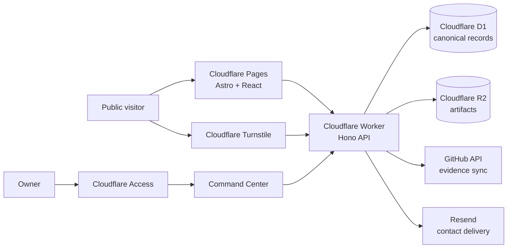

# usmanalii.com — Evidence-Backed Career OS

[](https://usmanalii.com)


**usmanalii.com** is a production portfolio and personal career operating system. It turns projects,
engineering journals, skills, capabilities, evidence, artifacts, decisions, and outcomes into one
owner-managed knowledge graph and a publication-safe public portfolio.

The public site is a live projection of canonical records managed through an authenticated Command
Center. Professional facts are not duplicated or hardcoded across pages.

## Product surfaces

- **Public portfolio** — work, evidence, journal, deep dives, skills, capabilities, and activity.
- **Recruiter view** — a live résumé assembled from published career records and relationships.
- **Command Center** — owner-managed CRUD, moderation, publishing, evidence linking, and GitHub sync.
- **Career Knowledge Universe** — a graph connecting projects, skills, capabilities, evidence, and
  journal entries.
- **GitHub evidence integration** — repository discovery, owner attribution, incremental sync, and a
  private review queue.
- **Protected visitor interactions** — Turnstile-verified contact and moderated journal responses.

## Architecture



| Layer                    | Responsibility                                                              |
| ------------------------ | --------------------------------------------------------------------------- |
| Astro + React            | Static public pages and the Command Center application shell                |
| Cloudflare Worker + Hono | Typed public/private APIs, authorization, projections, and integrations     |
| Cloudflare D1            | Canonical records, relationships, moderation state, and append-only history |
| Cloudflare R2            | Public and private artifact storage                                         |
| Cloudflare Access        | Owner identity and protected dashboard/API access                           |
| Turnstile                | Server-verified bot protection for visitor mutations                        |
| Resend                   | Transactional contact delivery from the verified portfolio domain           |

## Repository map

```text
apps/
  web/              Astro public site and dashboard UI
  worker/           Cloudflare Worker API
packages/
  authorization/    Identity, ownership, and visibility policy
  content/          Structured content import/export rules
  contracts/        Zod schemas and API DTOs
  database/         D1 repositories, migrations, and fixtures
  design-system/    Shared tokens and UI components
  domain/           Pure entities and business rules
  evidence/         Provenance, GitHub sync, and support-edge logic
  observability/    Structured logs, metrics, and error taxonomy
  search/           Public search and authenticated discovery
infrastructure/
  scripts/          Release, migration, and security verification
  wrangler/         Environment-specific Cloudflare configuration
docs/
  adrs/             Architecture Decision Records
```

## Local development

### Requirements

- Node.js 22+
- Corepack
- pnpm 9.15.4 (pinned by `packageManager`)

```bash
git clone https://github.com/usman611b/usmanalii.com.git
cd usmanalii.com
corepack enable
pnpm install --frozen-lockfile
```

Copy `.dev.vars.example` to `apps/worker/.dev.vars`, replace placeholders with local-only values,
then initialize and run the workspace:

```bash
pnpm db:init:local
pnpm auth:init:local
pnpm dev
```

Never use production credentials in local files. `.env*` and `.dev.vars` are excluded from Git.

## Quality gates

| Command                 | Purpose                                                   |
| ----------------------- | --------------------------------------------------------- |
| `pnpm lint`             | Strict linting across all 14 workspace packages           |
| `pnpm typecheck`        | TypeScript and Astro diagnostics                          |
| `pnpm test:sequential`  | Deterministic 13-project, 376-test inventory              |
| `pnpm build`            | Astro production build and Worker dry run                 |
| `pnpm migrations:check` | Immutable checksums and ordering for all 23 D1 migrations |
| `pnpm security:scan`    | Repository secret-pattern scan                            |
| `pnpm security:audit`   | High-severity dependency audit                            |
| `pnpm format:check:all` | Repository-wide Prettier validation                       |

CI repeats security scanning, type checking, linting, tests, migration verification, production
builds, Playwright browser coverage, and axe-core accessibility checks.

## Data and publication model

1. The owner creates or updates canonical records in the Command Center.
2. Relationships connect those records to projects, skills, capabilities, claims, and evidence.
3. Publication rules enforce visibility, lifecycle, approval, and evidence health.
4. Public pages request safe projections from the API in real time.
5. Revisions and append-only events preserve how the professional record evolved.

## Security model

- Cloudflare Access protects every owner-only dashboard and private API route.
- Private queries are owner-scoped; public APIs return publication-safe projections only.
- Turnstile tokens are validated server-side and are single use.
- Runtime credentials live in Cloudflare Worker secrets and never in repository files.
- CI performs dependency auditing and full-history secret scanning.
- Evidence verification and publication state are distinct from reader comments and reactions.

Report vulnerabilities through [SECURITY.md](SECURITY.md). Do not open a public issue containing a
secret, exploit, private record, or personal data.

## Documentation

- [Production release status](docs/PRODUCTION_RELEASE_STATUS.md)
- [Technical architecture](04-technical-architecture.md)
- [Database and evidence model](02-database-and-evidence-model.md)
- [UI/UX specification](03-ui-ux-visual-design-specification.md)
- [Security threat model](05b-security-threat-model-and-critical-review.md)
- [Requirements traceability](docs/traceability.md)
- [Architecture Decision Records](docs/adrs/)

## Contributing

See [CONTRIBUTING.md](CONTRIBUTING.md) for the development workflow, release gates, migration rules,
and pull-request expectations.

## Production

- Public site: [usmanalii.com](https://usmanalii.com)
- Recruiter view: [usmanalii.com/recruiter](https://usmanalii.com/recruiter)
- Journal: [usmanalii.com/journey](https://usmanalii.com/journey)
- Deep dives: [usmanalii.com/deep-dive](https://usmanalii.com/deep-dive)

Production operations, credentials, owner data, and deployment approvals remain private even when
the source repository is public.
